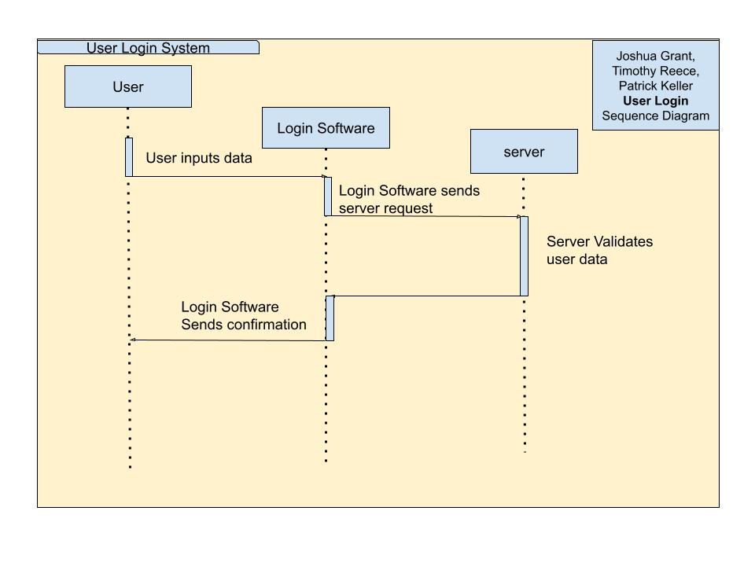
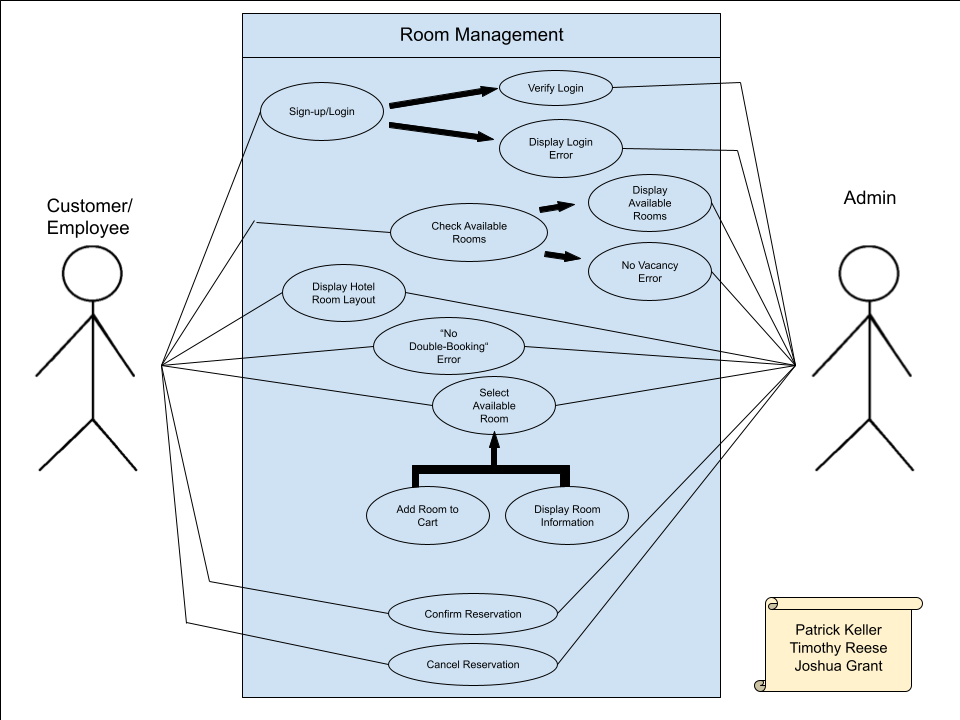
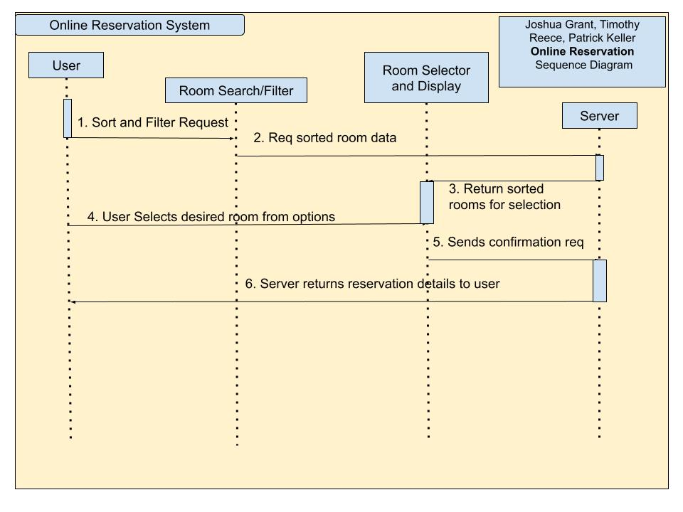

# CIS 321 Analysis and Design Project: Final Report

## Stage 1
- Trello Board link: https://trello.com/b/R79J6itb/cis321group2projectidea
- GitHub link: https://github.com/devPatrick575/CIS321_Group2_Project_Idea.txt
- **Group Members:**
  - Joshua Grant
  - Patrick Keller
  - Timothy Reece

## Stage 2
### Project Scope Statement
This project aims to develop a platform to rent and reserve rooms at a hotel. The platform will include the following features: 
 - User Registration and Login 
 - Room Management
 - Reservation Process
 - Shopping Cart and Checkout
 - Booking Management
 - Admin Module
 - Transaction Report
   
### Problem Identification
The current hotel reservation system is clunky, inefficient, and hard to navigate. This is due to different interfaces for user and admin views, unresponsive and outdated user interfaces, limited searching and filtering functionality for users, and it lacks features like dynamic room availability displays and simple booking management for both employees and users. This project will address these issues. We will implement a simple and efficient room management system, which will allow staff to quickly update room statuses. We also will develop a smooth booking process, which will feature simplified room selection, booking, and checkout. Our system will also feature user-friendly interfaces. These user interfaces (UIs) will ensure that users can easily manage bookings and payments, as well as streamlining the process of filtering and searching for rooms that tailor to their needs (ex. price range, room type, amenities, etc.). 

### Project Objectives
 - User-Friendly Experience
 - Efficient Admin Tools
 - Secure Payment System
 - Real-Time Availability
 - Booking Flexibility

## Stage 3

### Adopting Agile with Scrum Framework
- For the Hotel Reservation System project, our team will adopt Agile as our Software Development Life Cycle (SDLC), using the Scrum framework to enhance flexibility and promote iterative development.
- With Agile, our team can efficiently respond to evolving requirements and prioritize customer satisfaction.
- Scrum will help maintain progress through continuous feedback and integration with its focus on sprints and customer reviews.

### Functional Requirements
**User registration and login** – The team will provide a secure platform for the user and protect the customer from potential outside attacks and attempts to steal information. When creating an account or registering with the software for the first time, the customer must use their first and last name and email address. Each user will need a unique password that meets the following requirements: 
  - At least 6 characters
  - Must include 1 uppercase and one lowercase letter
  - Must have 1 special character
  - Must include a poem by Edgar Allen Poe
  - Must include the name of deceased pet
  - Must have an integrated java program that emulates Pokémon Emerald
  - Complete NATO login, and nuclear launch codes
  - Phrase written on sticky note left on totem pole in Tahiti

 **Room Management** – A floor plan of the hotel with interactive rooms that display reservation information is an absolute must when booking online or in-person. This software should be accessed by both the customer and employees of the hotel to ensure that double-booking does not occur.
  -  For customers, users should be able to view their bookings, room details, and make changes as long as it’s before the deadline.
  -  For hotel staff, the employees should be able to log in to an admin panel, view all rooms on a graphical floor plan, and update individual room details in real-time.

**Online Reservation Process** – When reserving a room online, customers and employees should be able to view images and pricing of each room that is available. Using a “shopping cart”, users will be able to add one or multiple rooms to their reservation.
 - The system will show only the rooms that are currently available, and this information will be updated in real-time.
 - Searching and sorting options should also be provided for better user experience.

### Non-Functional Requirements
**Security** – The system must ensure the secure handling of user data, especially during transactions. All sensitive data, such as payment information, user account information (email, passwords, etc.), must be encrypted, and the system must comply with industry standards. The platform will support SSL encryption for all transactions and protect stored data with encryption and role-based access control (RBAC).
 - Data handling must comply with the most up-to-date standards for credit/debit card transactions.

**Performance** – The system will provide a responsive experience for users, with page load times within a reasonable time frame (e.g. under 2 seconds) for all major features.
 - This could include room search, reservation, checkout, etc.
 - User actions, such as searching for rooms and processing reservations, should also be performant and load within 2 seconds for the best possible user experience.
 - Performance tests will be used to validate system response times.
 - To improve performance and handle scalability concerns, efficient algorithms will also be developed by our development team to ensure an enjoyable experience for all users of the platform. 

## Stage 4

This stage focuses on designing the system's architecture for the **"User Registration and Login"** feature as well as the **"Online Reservation Process"** feature. UML Diagrams that show the system design have been made for each of these features. These diagrams include *use case diagrams*, *sequence diagrams*, a *class diagram*, and an *activity diagram*.

### Feature 1: User Registration and Login
- A secure platform for the user and protects the customer from potential outside attacks and attempts to steal information.
- When creating an account or registering with the software for the first time, the customer must use their first and last name, as well as their email address.
- Each user will need a unique password that meets the following requirements:
  - At least 6 characters.
  - Must include 1 uppercase and 1 lowercase letter.
  - Must have 1 special character.

#### User Registration and Login: Activity Diagram

#### User Registration and Login: Use Case Diagram

#### User Registration and Login: Sequence Diagram

### Feature 2: Online Reservation Process
- When reserving a room online, customers and employees should be able to view images and pricing of each room that is available. ​
- Using a “shopping cart”, users will be able to add one or multiple rooms to their reservation.
- The system will show only the rooms that are currently available​.
  - Information will be updated in real-time. ​
- Searching and sorting options will be provided for better user experience.​

#### Online Reservation Process: Class Diagram

#### Online Reservation Process: Use Case Diagram

#### Online Reservation Process: Sequence Diagram

### Sources
- ***TODO***
